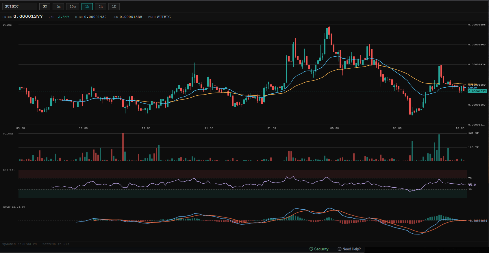

# Candlestick Chart Tool

[](https://hits.sh/github.com/knotnumb/SymbolComparisonTool/)

A dark-themed trading terminal built in vanilla JavaScript — no frameworks, no dependencies, just a single `index.html` you can open in any browser.



## Features

- **Live Binance data** — pulls from the public Binance REST API (`/api/v3`); no API key required
- **Searchable symbol dropdown** — type to filter from the full Binance spot symbol list
- **Timeframe selector** — 5m · 15m · 1h · 4h · 1D
- **Four stacked chart panels:**
  | Panel | Contents |
  |-------|----------|
  | Price | Candlesticks + EMA 20 (blue) + EMA 50 (amber) + current price line |
  | Volume | Volume bars |
  | RSI (14) | Relative Strength Index, 0–100 scale |
  | MACD (12, 26, 9) | MACD line, signal line, histogram |
- **Synced crosshair** — vertical line across all panels; horizontal value label per panel
- **OHLCV tooltip** — shows Open / High / Low / Close / Volume when hovering the price panel
- **24h stats bar** — last price, % change, 24h high, 24h low
- **Auto-refresh** — data refreshes every 30 seconds with a live countdown

## Usage

No build step. No install.

```bash
git clone https://github.com/knotnumb/SymbolComparisonTool.git
# then open index.html in your browser
```

Or just download `index.html` and open it directly.

## Technical notes

- Pure vanilla JS + Canvas 2D API
- Each chart panel has its own canvas + a transparent overlay canvas for the crosshair (`pointer-events: none`)
- Symbol dropdown uses `position: fixed` + `getBoundingClientRect()` to escape toolbar overflow clipping
- `apiFetch()` wrapper surfaces Binance API error messages (e.g. `"Invalid symbol."`)
- Crosshair X position derived from the price panel rect — consistent across all panels since they share the same horizontal padding

## Aesthetic

Terminal green/red (`#26a69a` / `#ef5350`), monospace font, `#0d0d0d` background. No UI libraries.

## License

MIT
